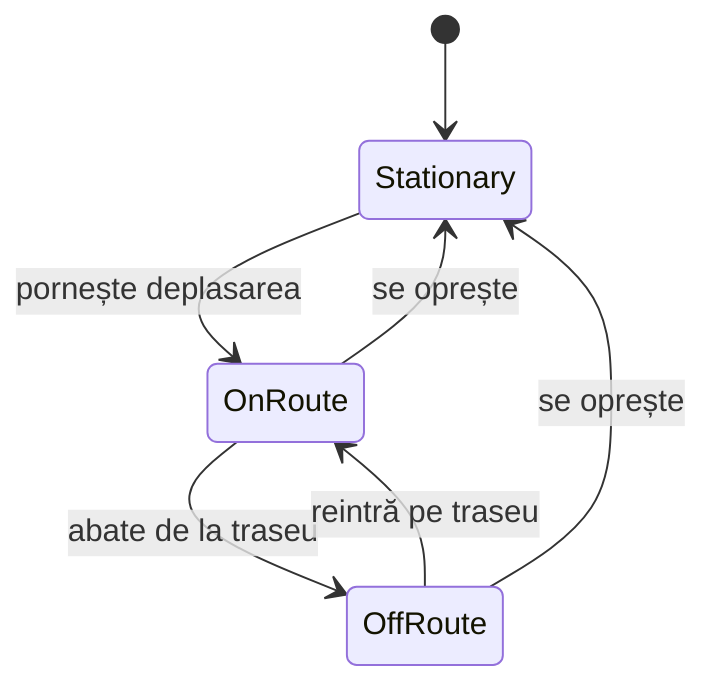
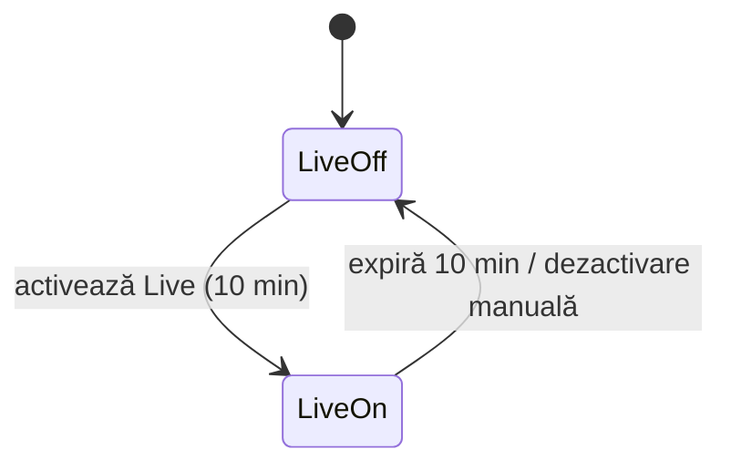
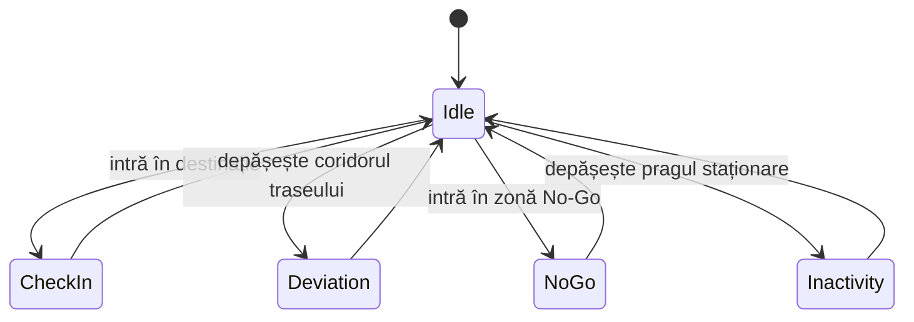
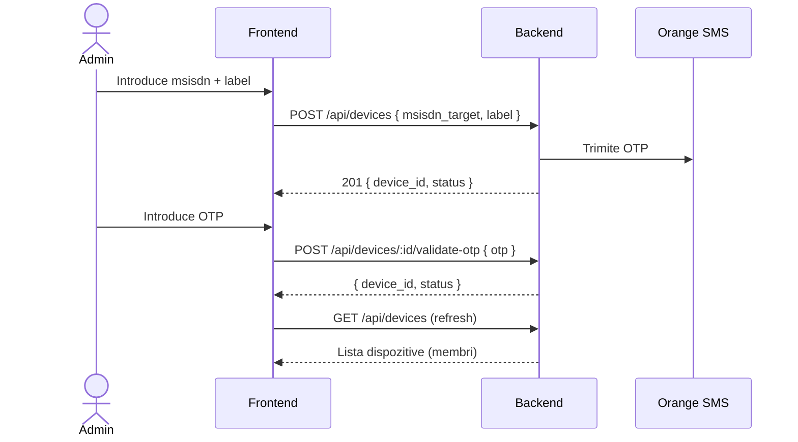
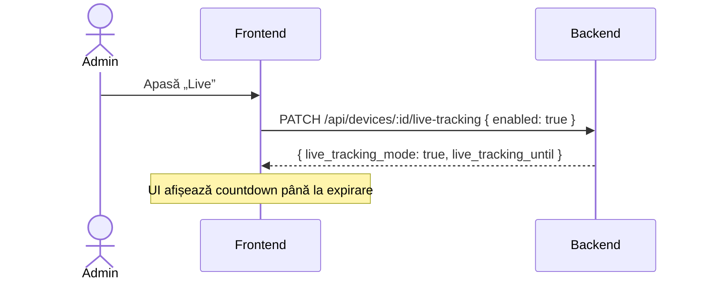
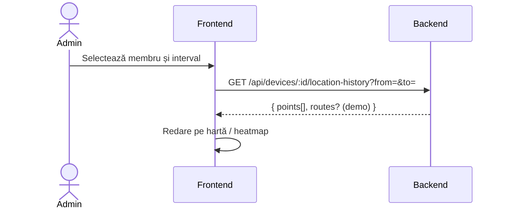

# Diagrame

Acest document conține diagramele de stare și diagramele de secvență pentru principalele fluxuri.

## Diagrama de Stare — Membru (Localizare)

## Diagrama de Stare — Live Tracking

## Diagrama de Stare — Alerte

## Diagrama de Secvență — Onboarding Membru (OTP)

## Diagrama de Secvență — Live Tracking

## Diagrama de Secvență — Istoric Locație (Time Machine)

