# Diagrame de Secvență — EchoSafe (PlantUML)

## Autentificare: Login
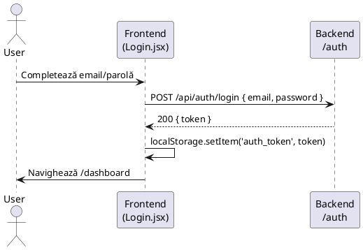

## Resetare Parolă — Cerere Link
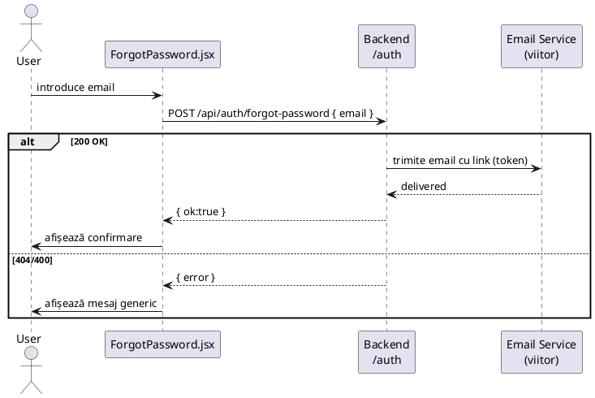

## Resetare Parolă — Setare Nouă
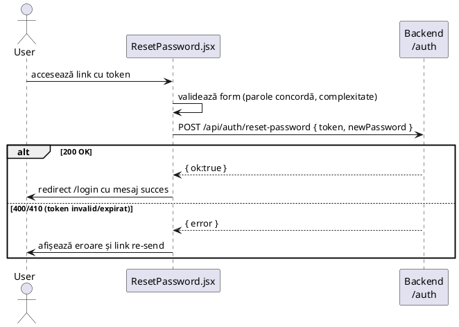

## Filtrare Alerte — Tip și Dată
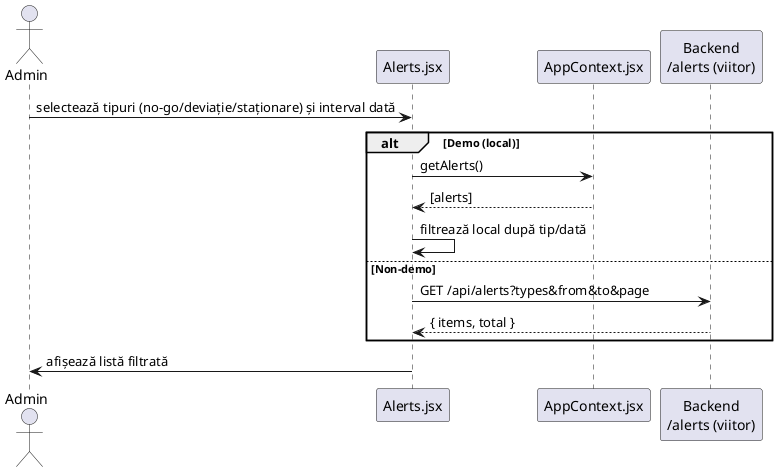

## Editare Rută Free‑Hand — Modifică Puncte
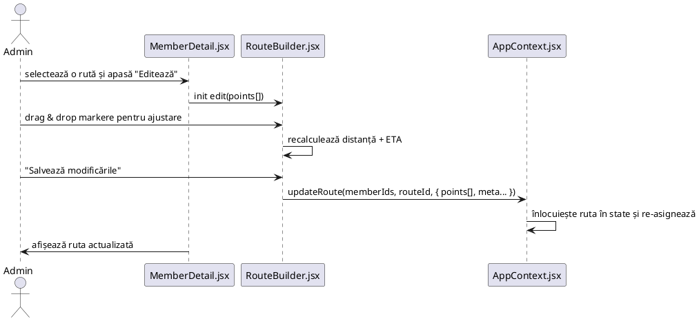
## Rute Protejate: ProtectedRoute
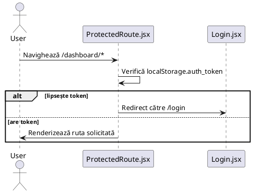

## Demo ON Toggle (Header)
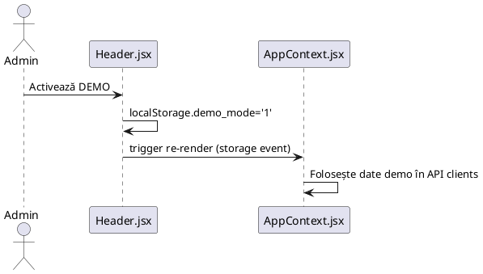

## Listare Dispozitive (Dashboard Load)
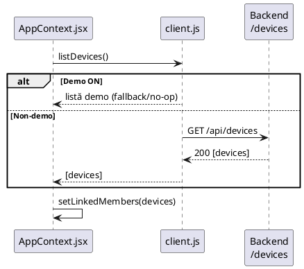

## Onboarding Membru (OTP) — Flux general
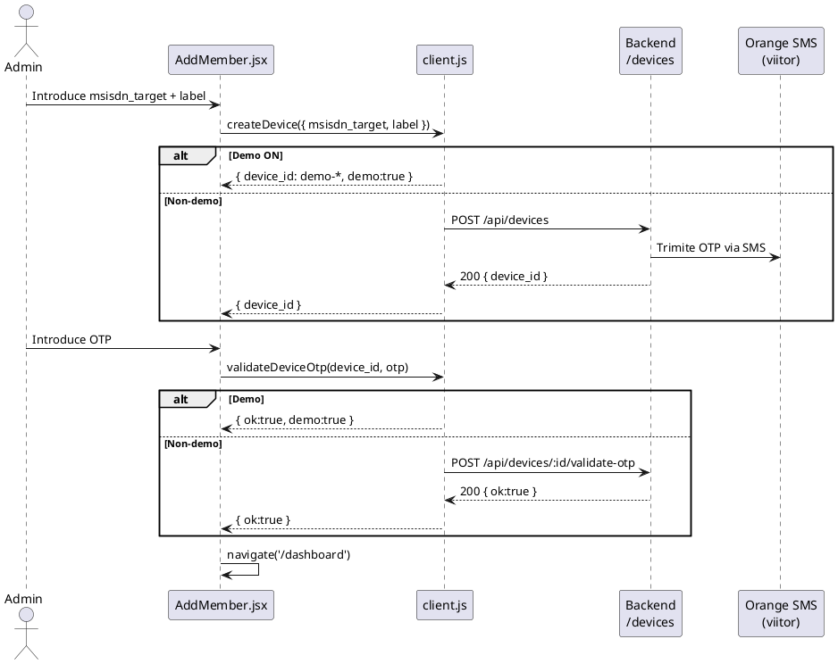

## Live Tracking: Pornire/Oprire și Contor
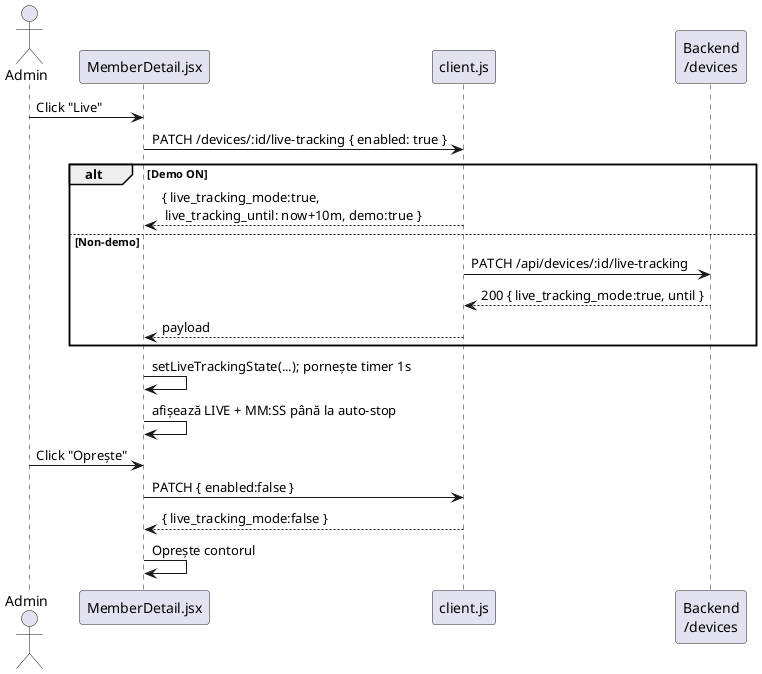

## Locație Curentă & Reachability
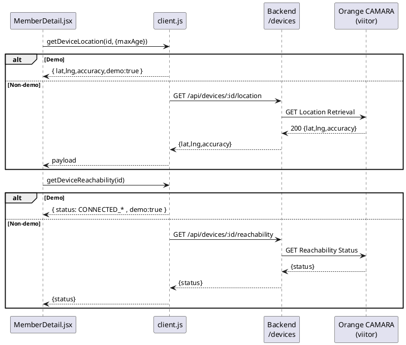

## Configurare Alerte (No‑Go, Deviație, Staționare)
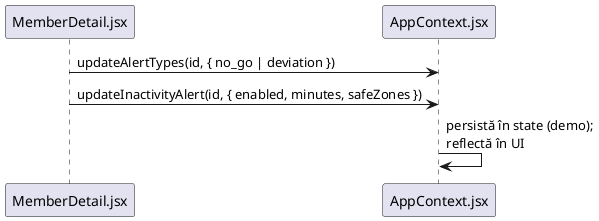

## RouteBuilder — Smart Path (Calculează → Salvează)
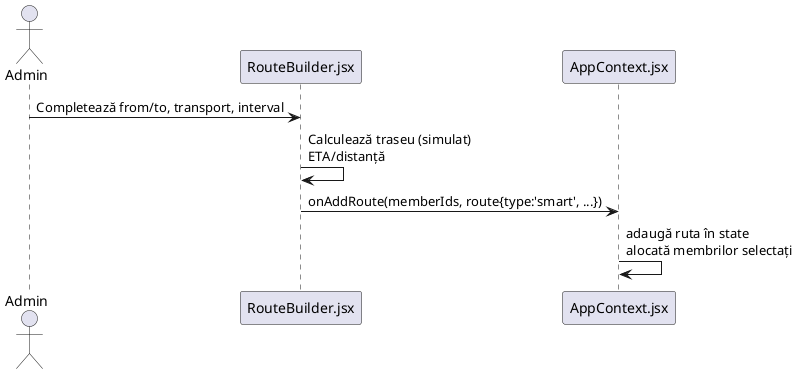

## RouteBuilder — Free‑Hand (Desen → Salvare)
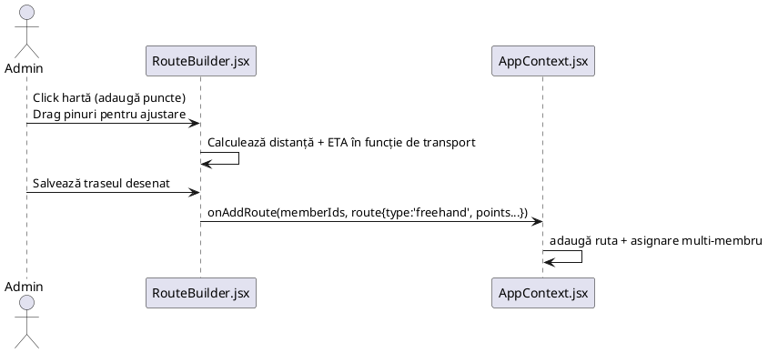

## Time Machine — Redare Traseu & Export CSV
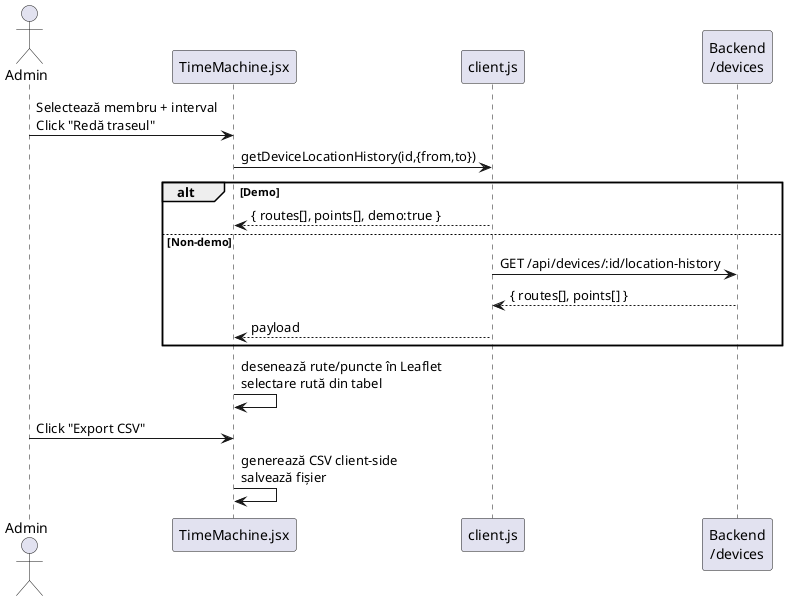

## Heatmap — Încărcare & Randare
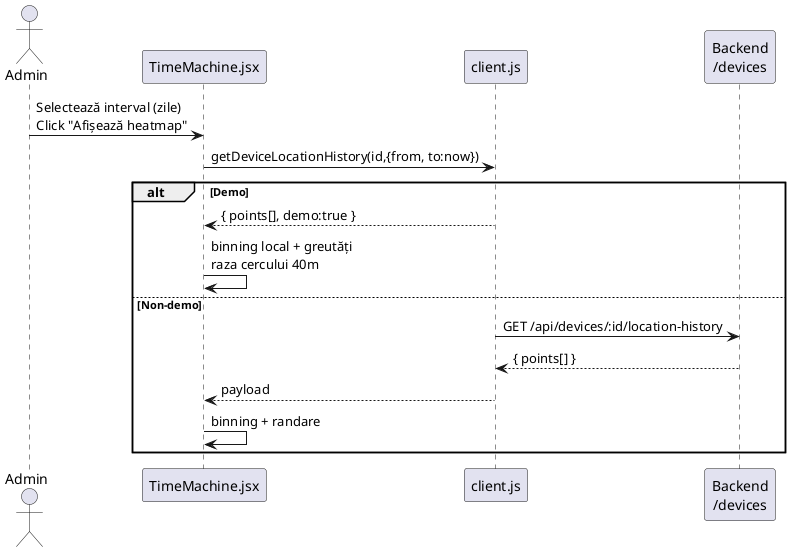

## Alerte — Istoric
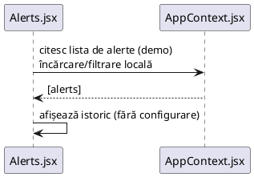

## Profil — Actualizare
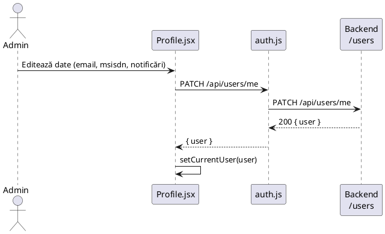

## Logout
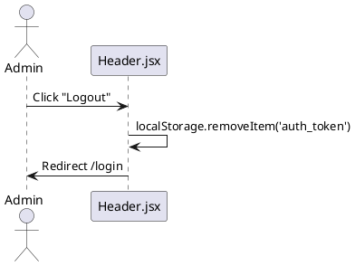

## Backend — Dev Helpers (Start Vite, Build)
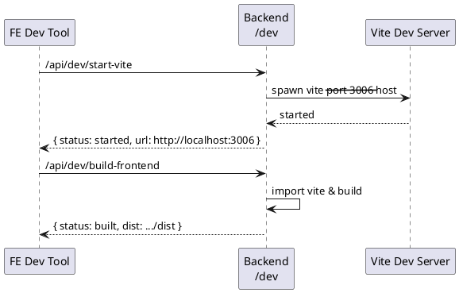

## Non‑demo — Integrare Orange (general)
```plantuml
@startuml
participant "Frontend" as FE
participant "Backend" as BE
participant "Orange CAMARA APIs" as ORANGE

FE -> BE: GET /api/devices/:id/location
BE -> ORANGE: GET Location Retrieval
ORANGE --> BE: lat/lng/accuracy
BE --> FE: payload

FE -> BE: GET /api/devices/:id/reachability
BE -> ORANGE: GET Reachability Status
ORANGE --> BE: status
BE --> FE: payload

FE -> BE: GET /api/devices/:id/location-history
BE -> ORANGE: GET Location History (sau din DB)
ORANGE --> BE: points/routes
BE --> FE: payload
@enduml
```

## E2E — Playwright (exemplu flux)
```plantuml
@startuml
actor "Playwright" as PW
participant "Browser (Chromium)" as B
participant "Frontend" as FE

PW -> B: Deschide /dashboard/time-machine
B -> FE: Redare UI
PW -> B: Click "Heatmap" → "Afișează heatmap"
FE -> FE: Fetch istoric (demo) → randare heatmap
PW -> B: Asserte "Heatmap demo"
@enduml
```

## Ștergere Traseu
```plantuml
@startuml
actor Admin as A
participant "MemberDetail.jsx" as FE
participant "AppContext.jsx" as CTX

A -> FE: Click "Șterge" pe un traseu
FE -> FE: confirm()
alt Confirmat
  FE -> CTX: removeRoute(memberId, routeId)
  CTX -> CTX: elimină ruta din state
else Anulat
  FE -> FE: fără modificări
end
@enduml
```

## Devices — Listare & Detalii
```plantuml
@startuml
participant "Frontend\n(MemberList.jsx)" as FE
participant "client.js" as API
participant "Backend\n/devices" as BE

FE -> API: listDevices()
alt Demo
  API --> FE: [devices] demo
else Non‑demo
  API -> BE: GET /api/devices
  BE --> API: 200 [devices]
  API --> FE: [devices]
end
FE -> FE: render listă; click pe membru
FE -> API: getDevice(id)
alt Demo
  API --> FE: {device} demo
else Non‑demo
  API -> BE: GET /api/devices/:id
  BE --> API: 200 {device}
  API --> FE: {device}
end
@enduml
```

## Devices — Location History (paginate/limit)
```plantuml
@startuml
participant "TimeMachine.jsx" as TM
participant "client.js" as API
participant "Backend\n/devices" as BE

TM -> API: getDeviceLocationHistory(id,{from,to,limit,offset})
alt Demo
  API --> TM: { points[], routes[], demo:true }
else Non‑demo
  API -> BE: GET /api/devices/:id/location-history?from&to&limit&offset
  BE --> API: 200 { points[], routes[] }
  API --> TM: payload
end
TM -> TM: randare + paginare locală
@enduml
```

## Devices — Auto‑Stop Live Tracking (10 min)
```plantuml
@startuml
participant "MemberDetail.jsx" as FE
participant "client.js" as API
participant "Backend\n/devices" as BE

FE -> API: PATCH live-tracking { enabled:true }
API -> BE: (non‑demo) PATCH /api/devices/:id/live-tracking
BE --> API: { until: now+10m, enabled:true }
API --> FE: { until, enabled:true }
... după 10 minute ...
FE -> FE: cron intern actualizează UI (MM:SS → 00:00)
FE -> API: PATCH live-tracking { enabled:false } (sau backend auto‑dezactivează)
API --> FE: { enabled:false }
@enduml
```

## No‑Go / Safe Zones — CRUD (demo curent)
```plantuml
@startuml
actor Admin as A
participant "MemberDetail.jsx" as FE
participant "AppContext.jsx" as CTX

A -> FE: Adaugă zonă (nume, poligon)
FE -> CTX: addNoGoZone(memberId, zone)
CTX -> CTX: update state
A -> FE: Editează / Șterge zonă
FE -> CTX: updateNoGoZone / removeNoGoZone
CTX -> CTX: update state
@enduml
```

## Selectare Rută din Tabel (Time Machine)
```plantuml
@startuml
actor Admin as A
participant "TimeMachine.jsx" as TM

A -> TM: Click pe rândul rutei
TM -> TM: setează selectedRouteId
TM -> TM: evidențiază polilinia corespunzătoare\nascunde celelalte (opacity low)
@enduml
```

## Eroare rețea — Fallback Demo
```plantuml
@startuml
participant "Frontend" as FE
participant "client.js" as API
participant "Backend" as BE

FE -> API: getDeviceLocation(id)
API -> BE: GET /api/devices/:id/location
BE --> API: 5xx / timeout
alt Demo ON
  API --> FE: payload demo (fallback)
else Non‑demo
  API --> FE: aruncă eroare → toast/alert
end
@enduml
```

## Înregistrare (Register)
```plantuml
@startuml
actor User as U
participant "Frontend\n(Register.jsx)" as FE
participant "Backend\n/auth" as BE

U -> FE: Completează formular
FE -> BE: POST /api/auth/register
BE --> FE: 201 { token | nextSteps }
FE -> FE: localStorage token (dacă există)\nnavigate('/dashboard' | '/login')
@enduml
```

## Export CSV — Eveniment Descărcare (UI)
```plantuml
@startuml
actor Admin as A
participant "TimeMachine.jsx" as TM
participant "Browser" as BR

A -> TM: Click "Export CSV"
TM -> TM: serialize points[] → CSV string
TM -> BR: trigger download (a[href=blob] click)
BR --> A: fișier *.csv salvat
@enduml
```

## ProtectedRoute — 401/403 și Refresh Token
```plantuml
@startuml
participant "ProtectedRoute.jsx" as PR
participant "client.js" as API
participant "Backend" as BE
participant "Login.jsx" as LG

PR -> PR: verifică localStorage.auth_token
alt token lipsește
  PR -> LG: redirect /login
else are token
  PR -> API: fetch resursă protejată
  API -> BE: GET /api/users/me
  alt 200 OK
    BE --> API: { user }
    API --> PR: user → render route
  else 401 Unauthorized
    BE --> API: 401
    API -> API: încearcă refresh (dacă există)
    alt refresh OK
      API --> PR: retry → render
    else refresh eșuat
      API --> PR: fail
      PR -> LG: redirect /login
    end
  else 403 Forbidden
    BE --> API: 403
    API --> PR: forbidden
    PR -> PR: afișează pagină 403 / redirect
  end
end
@enduml
```

## Login — Validări Formular și Erori API
```plantuml
@startuml
actor User as U
participant "Login.jsx" as FE
participant "auth.js" as API
participant "Backend\n/auth" as BE

U -> FE: submit { email, password }
FE -> FE: validare locală (format email, non‑empty password)
alt valid
  FE -> API: POST /api/auth/login
  alt 200 OK
    API -> FE: { token }
    FE -> FE: salvează token; navigate('/dashboard')
  else 4xx/5xx
    API -> FE: { error }
    FE -> FE: afișează mesaj eroare
  end
else invalid
  FE -> FE: afișează erori câmpuri
end
@enduml
```

## Alertă — Deviație de la Traseu (coridor)
```plantuml
@startuml
participant "Live Loop" as LOOP
participant "AppContext.jsx" as CTX
participant "Routes (free‑hand/smart)" as ROUTES
participant "Alerts Store" as AL

LOOP -> CTX: primește punct live (lat,lng,ts)
CTX -> ROUTES: găsește ruta activă pentru membru
ROUTES -> CTX: coridor (buffer) al rutei
CTX -> CTX: calculează distanța punctului față de coridor
alt în afara coridorului > threshold
  CTX -> AL: push { type: 'deviation', memberId, routeId, ts }
else în interiorul coridorului
  CTX -> CTX: fără alertă
end
@enduml
```

## Alertă — Staționare Prelungită (cu Safe Zones)
```plantuml
@startuml
participant "Live Loop" as LOOP
participant "AppContext.jsx" as CTX
participant "Config Inactivity" as CFG
participant "Safe Zones" as Z
participant "Alerts Store" as AL

LOOP -> CTX: punct live curent (lat,lng,ts)
CTX -> CTX: calculează viteză/mișcare (delta dist/ts)
alt mișcare < epsilon
  CTX -> CFG: minutaj necesar (ex. 15m)
  CTX -> CTX: acumulează timp staționare
  alt timp >= CFG.minutes
    CTX -> Z: verifica dacă în Safe Zone
    alt în Safe Zone
      CTX -> CTX: nu genera alertă
    else în afara Safe Zone
      CTX -> AL: push { type:'inactivity', minutes, location, ts }
    end
  else nu a atins pragul
    CTX -> CTX: continuă
  end
else există mișcare
  CTX -> CTX: resetează contor staționare
end
@enduml
```

## Alertă — No‑Go Zone (Intrare/Ieșire)
```plantuml
@startuml
participant "Live Loop" as LOOP
participant "AppContext.jsx" as CTX
participant "No‑Go Zones" as NG
participant "Alerts Store" as AL

LOOP -> CTX: punct live (lat,lng)
CTX -> NG: detectează intersectare poligon
alt intrare (în NG) și status anterior = afară
  CTX -> AL: push { type:'no-go-enter', zoneId, ts }
else ieșire (din NG) și status anterior = înăuntru
  CTX -> AL: push { type:'no-go-exit', zoneId, ts }
else fără tranziție
  CTX -> CTX: nici o alertă
end
@enduml
```

## Export CSV — Eșec și Retry
```plantuml
@startuml
actor Admin as A
participant "TimeMachine.jsx" as TM
participant "Browser" as BR

A -> TM: Click "Export CSV"
TM -> TM: serialize → Blob
alt succes
  TM -> BR: creează URL + click <a download>
  BR --> A: fișier *.csv
else aruncă excepție (quota/permisiuni)
  TM -> TM: afișează toast eroare
  A -> TM: click "Reîncearcă"
  TM -> TM: re‑generează și re‑trimite
end
@enduml
```

## Rută Smart — Schimbare Transport și Recalcul ETA
```plantuml
@startuml
actor Admin as A
participant "RouteBuilder.jsx" as RB
participant "AppContext.jsx" as CTX

A -> RB: selectează rută smart
A -> RB: schimbă transport (ex. Walk → Car)
RB -> RB: recalculează viteza medie și ETA
RB -> CTX: updateRoute(routeId, { transport, eta })
CTX -> CTX: actualizează ruta în state
RB -> A: afișează ETA/distanță recalculată
@enduml
```

## Free‑Hand — Schimbare Transport (ETA local)
```plantuml
@startuml
actor Admin as A
participant "RouteBuilder.jsx" as RB

A -> RB: schimbă transport (Walk/Bike/Car)
RB -> RB: recalculează ETA pe baza distanței free‑hand\nși vitezei implicite per transport
RB -> A: UI actualizat (ETA)
@enduml
```

## Realocare Rută către Alți Membri
```plantuml
@startuml
actor Admin as A
participant "MemberDetail.jsx" as FE
participant "AppContext.jsx" as CTX

A -> FE: selectează rută existentă
A -> FE: deschide dialog "Alocă la membri"
FE -> CTX: assignRoute(routeId, memberIds[])
CTX -> CTX: actualizează maparea rută↔membri
FE -> A: confirmare și listă membri actualizată
@enduml
```

## Export Rute în JSON
```plantuml
@startuml
actor Admin as A
participant "MemberDetail.jsx" as FE
participant "AppContext.jsx" as CTX
participant "Browser" as BR

A -> FE: Click "Exportă rute"
FE -> CTX: getRoutesForMember(memberId)
CTX --> FE: routes[]
FE -> BR: creează Blob JSON + descarcă
BR --> A: routes-<member>.json
@enduml
```

## Import Rute din JSON (validare și merge)
```plantuml
@startuml
actor Admin as A
participant "MemberDetail.jsx" as FE
participant "AppContext.jsx" as CTX
participant "Browser" as BR

A -> FE: Click "Importă rute" și selectează fișier
BR --> FE: conținut JSON
FE -> FE: validează schemă (type, points, meta)
alt valid
  FE -> CTX: mergeRoutes(memberId, routes[])
  CTX -> CTX: adaugă/înlocuiește rutele după routeId
  FE -> A: afișează rutele importate
else invalid
  FE -> A: eroare de validare
end
@enduml
```

## Destinații — CRUD și Legare la Staționare
```plantuml
@startuml
actor Admin as A
participant "MemberDetail.jsx" as FE
participant "AppContext.jsx" as CTX

A -> FE: Adaugă destinație (nume, coordonate)
FE -> CTX: addDestination(memberId, dest)
CTX -> CTX: update state
A -> FE: Activează "Staționare prelungită"
FE -> CTX: setInactivityAlert({ enabled:true, minutes, safeZones: [destIds] })
CTX -> CTX: persistă în state (demo)
@enduml
```

## Dashboard — Refresh în Masă (Locație + Reachability)
```plantuml
@startuml
actor Admin as A
participant "MemberList.jsx" as FE
participant "client.js" as API
participant "Backend\n/devices" as BE

A -> FE: Click "Refresh status"
FE -> API: batch getDeviceLocation(ids[])
FE -> API: batch getDeviceReachability(ids[])
alt Demo
  API --> FE: payload demo pentru fiecare membru
else Non‑demo
  API -> BE: GET /api/devices/:id/location (per membru)
  API -> BE: GET /api/devices/:id/reachability (per membru)
  BE --> API: răspunsuri
  API --> FE: agregare rezultate
end
FE -> FE: actualizează badges în listă
@enduml
```

## Backend — JWT Middleware (Auth)
```plantuml
@startuml
participant "Client" as CL
participant "Express Route" as RT
participant "JWT Middleware" as MW

CL -> RT: GET /api/secure-resource (Authorization: Bearer <jwt>)
RT -> MW: verify(token)
alt valid
  MW --> RT: req.user = claims
  RT -> CL: 200 payload
else invalid/expirat
  MW --> RT: throw 401
  RT -> CL: 401 Unauthorized
end
@enduml
```

## Heatmap (Non‑demo) — Agregare pe Server (viitor)
```plantuml
@startuml
actor Admin as A
participant "TimeMachine.jsx" as TM
participant "Backend\n/analytics" as BE
participant "DB (PostGIS)" as DB

A -> TM: Heatmap interval [from,to]
TM -> BE: GET /api/analytics/heatmap?memberId&from&to&grid=1km
BE -> DB: ST_SnapToGrid + agregări densitate
DB --> BE: cells[], weights
BE --> TM: payload heatmap
TM -> TM: randare heatmap client
@enduml
```

## Profile — Schimbare Parolă (Autentificat)
```plantuml
@startuml
actor Admin as A
participant "Profile.jsx" as PF
participant "Backend\n/auth" as BE

A -> PF: completează { oldPassword, newPassword }
PF -> BE: POST /api/auth/change-password
alt 200 OK
  BE --> PF: { ok:true }
  PF -> A: toast succes
else 400/401
  BE --> PF: { error }
  PF -> A: afișează eroare
end
@enduml
```

## Notificări Alerte — Push & SMS (viitor)
```plantuml
@startuml
participant "Alerts Engine" as AE
participant "Push Service\n(Web Push/FCM)" as PUSH
participant "SMS Provider\n(viitor)" as SMS
actor Admin as A

AE -> AE: generează alertă (no-go|deviation|inactivity)
AE -> PUSH: sendPush(userId, payload)
PUSH --> AE: 2xx ack
AE -> SMS: sendSMS(msisdn, text) (opțional)
SMS --> AE: delivered/id
AE -> A: UI badge/Toast cu alertă nouă
@enduml
```

## Time Machine — Controale Redare (Play/Pause/Seek/Viteză)
```plantuml
@startuml
actor Admin as A
participant "TimeMachine.jsx" as TM
participant "Timer" as T

A -> TM: Click Play
TM -> T: start(1s interval * speed)
T -> TM: tick → avansează index puncte
TM -> TM: actualizează marker poziție curentă
A -> TM: Click Speed x2/x4
TM -> T: update interval (mai des)
A -> TM: Click Pause
TM -> T: stop()
A -> TM: Drag slider (seek)
TM -> TM: setează index curent; randare la poziție
@enduml
```

## Free‑Hand — Undo/Redo Puncte
```plantuml
@startuml
actor Admin as A
participant "RouteBuilder.jsx" as RB

A -> RB: Click pe hartă (addPoint)
RB -> RB: push în stack curent
A -> RB: Click dreapta (Undo)
RB -> RB: pop ultimul punct → push în redo stack
A -> RB: Click "Redo"
RB -> RB: re‑adaugă din redo stack
RB -> A: UI polilinie actualizată
@enduml
```

## AddressAutocomplete — Geocoding Provider
```plantuml
@startuml
actor Admin as A
participant "AddressAutocomplete.jsx" as AA
participant "Geocoding Provider\n(Nominatim/Mapbox - viitor)" as GEO

A -> AA: tastează adresa
AA -> GEO: GET /search?q=<text>&limit=5
GEO --> AA: [{ label, lat, lng }]
AA -> A: afișează sugestii; onSelect → setează coordonate
@enduml
```

## Backend — Static Serve SPA (Fallback)
```plantuml
@startuml
participant "Browser" as BR
participant "Express Static" as ST
participant "SPA Fallback" as FB

BR -> ST: GET /dashboard/member/123
alt fișier static găsit
  ST --> BR: 200 asset
else rută SPA
  ST -> FB: handle fallback
  FB --> BR: return index.html
end
@enduml
```

## Orange API — Rate Limit & Retry (Non‑demo)
```plantuml
@startuml
participant "Backend" as BE
participant "Orange CAMARA" as OR

BE -> OR: GET /reachability
alt 429 Too Many Requests
  OR --> BE: 429 + Retry-After
  BE -> BE: backoff (exponential) + respect Retry-After
  BE -> OR: retry
  OR --> BE: 200 { status }
else 200
  OR --> BE: 200 { status }
end
@enduml
```

## Admin — Suspendare / Ștergere Cont
```plantuml
@startuml
actor Admin as A
participant "Profile.jsx" as PF
participant "Backend\n/users" as BE

A -> PF: click "Suspendă cont"
PF -> BE: POST /api/users/me/suspend
BE --> PF: { ok:true, until }
PF -> A: status "Suspendat" în UI

A -> PF: click "Șterge cont"
PF -> BE: DELETE /api/users/me
BE --> PF: 204 No Content
PF -> A: logout + redirect /goodbye
@enduml
```
